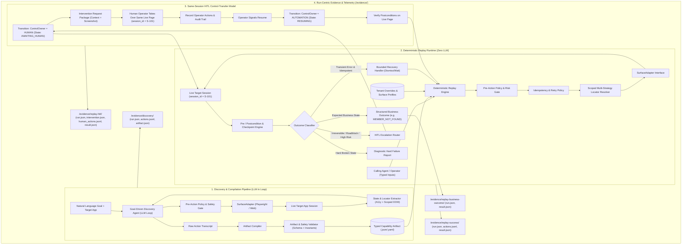

# Computer-Use Automation System: Refined Architecture Design & Implementation Plan

## Executive Summary & Core Philosophy

This design implements a robust, production-grade **Computer-Use Automation System** tailored for legacy banking and credit union back-office software.
The fundamental architectural boundary is:
> **The LLM is a discovery and synthesis mechanism; the compiled Capability Artifact replayed through a Surface Adapter is the deterministic production execution engine (Zero LLM in the loop).**

---

## Refined System Architecture



---

## 1. Architectural Pillar: The Surface Adapter Boundary

To decouple the capability contract from specific browser automation tools (and support legacy web, desktop OS automation, and future CUA agents):

### The Surface Interface Protocol
```python
from typing import Protocol, Any, Dict, List, Optional
from dataclasses import dataclass

@dataclass
class SurfaceState:
    url_or_window: str
    title: str
    accessibility_tree: Dict[str, Any]
    active_frame: Optional[str]
    viewport: Dict[str, int]
    screenshot_bytes: bytes

@dataclass
class ResolvedElement:
    handle: Any
    matched_strategy: str
    confidence: float
    frame_context: Optional[str]

class SurfaceAdapter(Protocol):
    """Abstract seam separating how we perceive/act on a surface from the recorded flow."""
    async def initialize(self, session_id: str, entry_point: str) -> None: ...
    async def observe(self) -> SurfaceState: ...
    async def resolve_target(self, target_spec: Dict[str, Any]) -> ResolvedElement: ...
    async def click(self, element: ResolvedElement) -> None: ...
    async def type_text(self, element: ResolvedElement, text: str, sensitive: bool = False) -> None: ...
    async def select_option(self, element: ResolvedElement, value: str) -> None: ...
    async def read_text(self, element: ResolvedElement) -> str: ...
    async def read_table(self, element: ResolvedElement) -> List[Dict[str, str]]: ...
    async def capture_screenshot(self, mask_sensitive: bool = True) -> bytes: ...
    async def close(self) -> None: ...
```

### Concrete Adapters:
- `PlaywrightSurfaceAdapter`: Production web implementation supporting modern DOM, legacy framesets, nested iframes, table parsing, and headed takeover.
- `DesktopSurfaceAdapter` *(Design-documented)*: Translates surface actions to Windows UI Automation / macOS Accessibility APIs.
- `CUASurfaceAdapter` *(Design-documented)*: Translates surface actions to coordinate/vision models.

---

## 2. Multi-Tenant Portability & Application Variant Model

Banks share vendor software (e.g. Apex CoreBank v4.2) with tenant-specific branding, field IDs, or custom URLs.

```
Base Capability (Vendor + Product + Family)
       ├── Variant Profile (e.g., v4.2-default vs v4.2-custom-forms)
       └── Tenant Overrides (Base URLs, Tenant-specific locator patches)
```

### Degradation & Drift Management
Each capability tracks runtime health across tenant instances:
- **Capability Health State**: `APPROVED` $\to$ `DEGRADED` (if primary locator confidence drops or fallback triggers consistently) $\to$ `INVALID` (if checkpoint fails repeatedly).
- **Tenant Variant Resolution**: Replay loads the Base Capability, overlays the Tenant Profile (e.g. custom base URL, overridden locator priorities), executes, and logs locator match statistics to detect per-tenant UI drift.

---

## 3. Strengthened Capability Artifact Schema

The artifact is an explicit contract with pre/postconditions, scoped multi-strategy locators, iframe contexts, declarative recovery, and typed outputs:

```yaml
schema_version: "1.0.0"
capability_id: "corebank.member.get_balance"
version: "1.0.0"
status: "APPROVED"
name: "Lookup Member Balances"
description: "Searches for a member by ID in CoreBank Console and extracts savings and checking balances."

application:
  vendor: "Apex"
  product: "CoreBank"
  min_version: "4.0.0"
  supported_variants: ["default", "tenant_branded"]

entry_point:
  route: "/console/members"
  allowed_domains: ["localhost:8080", "127.0.0.1:8080"]

inputs_schema:
  member_id:
    type: "string"
    description: "5-digit member account identifier"
    required: true
    sensitive: false

outputs_schema:
  member_name:
    type: "string"
    nullable: false
  account_status:
    type: "string"
    nullable: false
  savings_balance:
    type: "decimal"
    nullable: true
  checking_balance:
    type: "decimal"
    nullable: true

preconditions:
  - type: "route_matches"
    pattern: "/console/members"
  - type: "element_present"
    target:
      scope: "body"
      locators:
        - strategy: "role_and_name"
          value: "heading[name='Member Services Console']"

steps:
  - id: "step_enter_member_id"
    description: "Enter member ID into the search form"
    action: "type"
    risk_level: "READ_ONLY"
    idempotent: true
    retryable: true
    target:
      scope: "form[name='searchForm']"
      frame_context: null
      locators:
        - strategy: "accessibility"
          value: "textbox[name='Member ID / Account #']"
          confidence: 0.98
          reasoning: "Semantic accessible role and aria label"
        - strategy: "css_scoped"
          value: "input.legacy-input[name='memberId']"
          confidence: 0.85
          reasoning: "Legacy class within scoped searchForm"
        - strategy: "xpath_structural"
          value: ".//td[contains(text(),'Member ID')]/following-sibling::td/input"
          confidence: 0.75
          reasoning: "Table cell label adjacency"
    value_template: "{{ inputs.member_id }}"
    postcondition:
      type: "value_matches"
      expected: "{{ inputs.member_id }}"

  - id: "step_click_search"
    description: "Click the search submit button"
    action: "click"
    risk_level: "READ_ONLY"
    idempotent: true
    retryable: true
    target:
      scope: "form[name='searchForm']"
      locators:
        - strategy: "accessibility"
          value: "button[name='Search Records']"
          confidence: 0.95
        - strategy: "css_scoped"
          value: "input[type='submit'][value='Search']"
          confidence: 0.85
        - strategy: "xpath_structural"
          value: ".//button[text()='Search']"
          confidence: 0.70
    postcondition:
      any_of:
        - id: "branch_member_found"
          type: "element_present"
          target:
            scope: "body"
            locators:
              - strategy: "css_scoped"
                value: "table.account-summary-table"
          outcome_type: "SUCCESS"
        - id: "branch_member_not_found"
          type: "text_present"
          text_pattern: "Error: Member ID not found"
          outcome_type: "BUSINESS_OUTCOME"
          outcome_code: "MEMBER_NOT_FOUND"
    recovery_rules:
      - condition: "TRANSIENT_INTERSTITIAL"
        action: "dismiss_modal"
        target:
          locators:
            - strategy: "accessibility"
              value: "button[name='Dismiss Notice']"
        max_attempts: 1

  - id: "step_extract_balances"
    description: "Extract balances from member summary table"
    action: "extract"
    risk_level: "READ_ONLY"
    idempotent: true
    retryable: true
    extractions:
      - field: "member_name"
        target:
          locators:
            - strategy: "xpath_structural"
              value: "//td[@id='lbl_memberName']"
        transform: "strip"
      - field: "savings_balance"
        target:
          locators:
            - strategy: "xpath_structural"
              value: "//tr[td[contains(text(),'Regular Savings')]]/td[@class='bal-val']"
        transform: "parse_currency"
      - field: "account_status"
        target:
          locators:
            - strategy: "xpath_structural"
              value: "//span[@id='badge_status']"
        transform: "strip"

postconditions:
  - type: "output_populated"
    field: "member_name"

policy:
  risk_level: "READ_ONLY"
  allowed_actions: ["click", "type", "extract", "scroll"]
  max_step_timeout_ms: 5000
```

---

## 4. Deterministic Replay Engine & Idempotency-Aware Error Taxonomy

### The 4 Execution Outcomes:
1. **`SUCCESS`**: All steps and postconditions satisfied; returns typed `result.outputs`.
2. **`BUSINESS_OUTCOME`**: Legitimate domain state reached (e.g. `MEMBER_NOT_FOUND`, `ACCOUNT_FROZEN`, `INSUFFICIENT_FUNDS`); returns `result.outcome_code` and message without failure/crash.
3. **`RECOVERABLE`**: Transient loading or known dismissable interstitial; triggers bounded mitigation and retries **only if action is declared idempotent**.
4. **`HARD_FAILURE` / `ESCALATE`**: Unrecoverable state, policy violation, or unknown popup; generates diagnostic package (screenshot, DOM, stack) and routes to HITL or halts.

```python
@dataclass
class ReplayResult:
    status: str  # "SUCCESS" | "BUSINESS_OUTCOME" | "RECOVERED" | "ESCALATED" | "HARD_FAILURE"
    outcome_code: Optional[str]  # e.g., "MEMBER_NOT_FOUND"
    outputs: Dict[str, Any]
    error: Optional[Dict[str, Any]]
    session_id: str
    execution_duration_ms: float
    steps_executed: int
```

---

## 5. HITL Control-Transfer Model & Same-Session Guarantee

### Formal State Machine & Control Ownership
```
ControlOwner = AUTOMATION | HUMAN

States:
  RUNNING_AUTOMATION  ──(Stuck / High-Risk / Roadblock)──>  AWAITING_HUMAN
  AWAITING_HUMAN      ──(Operator Connects / Interacts)─>  HUMAN_CONTROL
  HUMAN_CONTROL       ──(Operator Signals Resume)────────>  RESUMING
  RESUMING            ──(Verify Postconditions)──────────>  RUNNING_AUTOMATION
  AWAITING_HUMAN      ──(Operator Signals Abort)─────────>  ABORTED
```

### The Same-Session Execution Seam:
1. **Preserved Session**: The automation keeps the `PlaywrightSurfaceAdapter` instance (`BrowserContext` and `Page`) alive with its active `session_id`.
2. **Intervention Package**: The system writes `intervention_request.json` containing:
   - `session_id`, `capability_id`, `step_index`, `reason`, `screenshot_path`, `allowed_actions`.
3. **Operator Interaction**:
   - For demo/CLI: The browser window is brought to focus, the CLI prompts the operator with context, the human performs the action on the live page, and presses Enter / signals resume.
4. **Resumption & Invariant Check**: The engine verifies postconditions on the *same live session*, appends operator actions to `human_actions.jsonl`, transfers `ControlOwner = AUTOMATION`, and resumes deterministic execution.

---

## 6. Pre-Action Policy Gate & Safe Redaction Pipeline

### Pre-Action Safety Gate
Before any action reaches the `SurfaceAdapter`, it passes through `PolicyGate.evaluate(action, target, capability_metadata)`:
- Checks URL allowlist (Regex matching authorized domains).
- Checks Action verb allowlist.
- Analyzes Action Risk: If action targets an irreversible operation (e.g. `Authorize Creation`, `Transfer Funds`) and lacks explicit approval token, it blocks execution and routes to HITL.

### Regulated Data & PII Redaction
- **Textual Redaction**: Regex-based masking for SSN (`***-**-1234`), Account Numbers (`*****6789`), Passwords, and Auth Tokens across all logs, JSON artifacts, and traces.
- **Screenshot Redaction**: Synthetic banking data guarantee + DOM masking injection (`visibility: hidden` / black box overlay on sensitive DOM nodes before `capture_screenshot()`).

---

## 7. Discovery Agent & Artifact Compilation Pipeline

The discovery phase follows a strict validation boundary:
```
LLM Observation Loop
       ↓
Raw Transcript (Steps + Observed Locators + Dynamic Values)
       ↓
Candidate Artifact Generator
       ↓
Artifact Compiler & Normalizer (Extracts parameter templates like {{ inputs.member_id }})
       ↓
Schema & Safety Validator (Validates Pydantic schema, ensures zero raw secrets, checks allowlist)
       ↓
Replay Validation (Dry-run validation on live surface)
       ↓
Approved Capability Artifact
```

---

## 8. Run-Centric Evidence Structure

All runs are recorded with unique IDs and session identifiers in `/evidence/`:
```
evidence/
├── discovery/
│   ├── run.json                  # Metadata, duration, LLM token metrics
│   ├── actions.jsonl             # Step-by-step LLM decisions and observations
│   ├── screenshots/              # Discovery step screenshots
│   └── compiled_capability.json  # Resulting capability artifact
├── replay-success/
│   ├── run.json                  # Session ID, parameters, status = SUCCESS
│   ├── actions.jsonl             # Deterministic step executions & locator confidences
│   ├── result.json               # Extracted typed outputs
│   └── screenshot_final.png
├── replay-business-outcome/
│   ├── run.json                  # Session ID, input = "99999" (non-existent)
│   ├── result.json               # status = BUSINESS_OUTCOME, outcome_code = MEMBER_NOT_FOUND
│   └── screenshot_outcome.png
└── replay-hitl/
    ├── run.json                  # Single session_id spanning automation + human
    ├── intervention.json         # Intervention request context and trigger reason
    ├── human_actions.jsonl       # Logged human takeover event
    └── result.json               # Successful post-resumption result
```

---

## 9. Verification & Test Plan

1. **Automated Unit & Schema Tests**:
   - Pydantic schema validation, invalid artifact rejection.
   - Pre-action policy gate blocking unsafe domains and unauthorized high-risk actions.
   - PII redactor masking text patterns.
   - Locator resolver fallback logic across multiple strategies.
2. **Replay Determinism & Zero-LLM Isolation**:
   - Execute replay with LLM API keys explicitly unset/mocked to prove zero LLM dependency.
   - Validate Idempotency & bounded retry behavior.
3. **End-to-End Test Suite against Apex CoreBank**:
   - Discovery run on Member Balance Query $\to$ Generates artifact.
   - Replay Run 1: Happy path balance extraction $\to$ `SUCCESS`.
   - Replay Run 2: Non-existent member query $\to$ `BUSINESS_OUTCOME` (`MEMBER_NOT_FOUND`).
   - Replay Run 3: Transient interstitial modal $\to$ `RECOVERED` $\to$ `SUCCESS`.
   - Replay Run 4: Sub-account creation with high-risk confirmation $\to$ `HITL_TAKEOVER` $\to$ Resume $\to$ `SUCCESS`.
